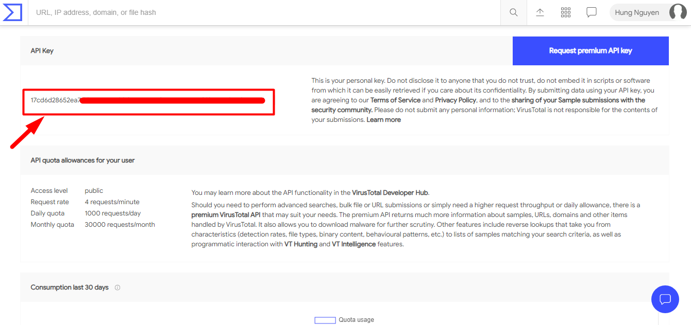
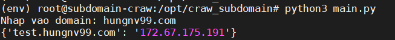
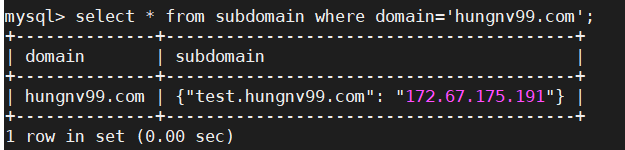
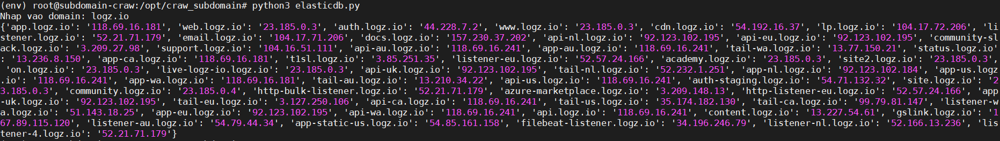
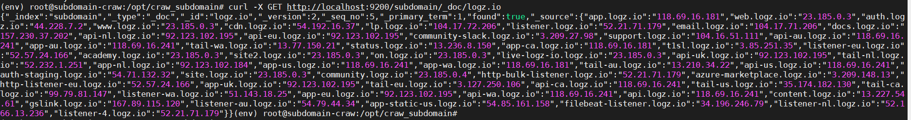

# craw_subdomain

Tool sử dụng để craw các subdomain và in ra ác subdomain cùng ip của subdomain đó, đồng thời lưu vào database của elasticseach hoặc mysql. 

### 1. Cài đặt các gói cần thiết 

```
apt install -y git nmap 
apt install python3-pip
```

### 2. Cài đặt mysql nếu muốn lưu vào mysql

#### 2.1 Cài đặt 
- Cài đặt mysql server

```
apt install mysql-server
```

- Thiết lập secure cho mysql 

```
mysql_secure_installation
```

#### 2.2 Tạo cơ sở dữ liệu 

- Đăng nhập vào cơ sở dữ liệu và thực hiện tạo csdl như sau: 

```
create database craw_domain;
```
```
use craw_domain;
```
```
CREATE TABLE `subdomain` (
  domain varchar(255) NULL,
  subdomain json DEFAULT NULL
);
```

- Tạo user và gán cho quyền truy cập database 

```
grant all privileges on craw_domain.* to "subuser"@"localhost" identified by 'Subdomain2020@';
```
```
FLUSH PRIVILEGES;
exit;
```

### 3. Cài đặt elasticsearch nếu muốn lưu vào elastic

- Cài đặt các phụ thuộc

```
apt install -y openjdk-8-jre apt-transport-https
```

- Cài đặt elasticsearch 

```
wget -qO - https://artifacts.elastic.co/GPG-KEY-elasticsearch | sudo apt-key add -
```
```
echo "deb https://artifacts.elastic.co/packages/7.x/apt stable main" | sudo tee -a /etc/apt/sources.list.d/elastic-7.x.list
```

```
apt update -y
apt install elasticsearch -y
```

- Chỉnh sửa cấu hình elasticsearch 

```
sed -i 's/#network.host: 192.168.0.1/network.host: localhost/g' /etc/elasticsearch/elasticsearch.yml
```

- Khởi động và xem trạng thái của elasticsearch

```
systemctl start elasticsearch
systemctl enable elasticsearch
systemctl status elasticsearch
```

### 4. Tạo tài khoản Virustotal 

Truy cập virustotal và kích vào tạo tài khoản. 


Sau khi đã có tài khoản đăng nhập virustotal, truy cập vào API key để lấy key API. 




Lưu lại api key để dùng cho bước sau.

### 5. Tải về tool và cài đặt môi trường

- Tải về tool

```
cd /opt
git clone https://github.com/hungviet99/craw_subdomain.git
```

- Cài đặt môi trường ảo python

```
cd /opt/craw_subdomain
pip3 install virtualenv
virtualenv env -p python3.6
source env/bin/activate
```

- Cài đặt các thư viện cần thiết

```
pip3 install -r requirements.txt
```

- Chỉnh sửa file config. 

```
sed -i 's/api_vt =/api_vt= "17cd6d28652ea7dd99a0ea9abbfe07c68ecf8ath01e950fgdf2365af80b05967"/' /opt/craw_subdomain/config.py
```
>Lưu ý: Thay `17cd6d28652ea7dd99a0ea9abbfe07c68ecf8ath01e950fgdf2365af80b05967` bằng api virustotal của bạn.

- Chạy tool 

**Nếu muốn lưu vào Mysql**

```
python3 main.py
```

**Nếu muốn lưu vào elasticsearch**

```
python3 python3 elasticdb.py
```

### 6. Kết quả 

**Kiểm tra đối với mysql**

- Sau khi chạy tool, kết quả được in ra màn hình: 



- Kiểm tra kết quả trong database



**Kiểm tra đối với elasticsearch**

- Sau khi chạy, kết quả được in ra màn hình 



- Kiểm tra kết quả trong DB của elastic bằng lệnh sau

```
curl -X GET http://localhost:9200/subdomain/_doc/logz.io
```

