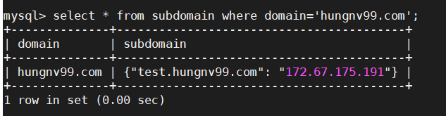

# craw_subdomain

### 1. Cài đặt các gói cần thiết 

```
apt install -y git nmap 
apt install python3-pip
```

### 2. Cài đặt mysql 

#### 2.1 Cài đặt 
- Cài đặt mysql server

```
apt install mysql-server
```

- Thiết lập secure cho mysql 

```
mysql_secure_installation
```

#### 2.2 Tạo cơ sở dữ liệu 

- Đăng nhập vào cơ sở dữ liệu và thực hiện tạo csdl như sau: 

```
create database craw_domain;
```
```
use craw_domain;
```
```
CREATE TABLE `subdomain` (
  domain varchar(255) NULL,
  subdomain json DEFAULT NULL
);
```

- Tạo user và gán cho quyền truy cập database 

```
grant all privileges on craw_domain.* to "subuser"@"localhost" identified by 'Subdomain2020@';
```
```
FLUSH PRIVILEGES;
exit;
```
### 3. Tạo tài khoản Virustotal 

Truy cập virustotal và kích vào tạo tài khoản. 


Sau khi đã có tài khoản đăng nhập virustotal, truy cập vào API key để lấy key API. 


Lưu lại api key để dùng cho bước sau.

### 4. Tải về tool và cài đặt môi trường

- Tải về tool

```
cd /opt
git clone https://github.com/hungviet99/craw_subdomain.git
```

- Cài đặt môi trường ảo python

```
cd /opt/craw_subdomain
pip3 install virtualenv
virtualenv env -p python3.6
source env/bin/activate
```

- Cài đặt các thư viện cần thiết

```
pip3 install -r requirements.txt
```

- Chỉnh sửa file config. 

```
sed -i 's/api_vt =/api_vt= "17cd6d28652ea7dd99a0ea9abbfe07c68ecf8ath01e950fgdf2365af80b05967"/' /opt/craw_subdomain/config.py
```
>Lưu ý: Thay `17cd6d28652ea7dd99a0ea9abbfe07c68ecf8ath01e950fgdf2365af80b05967` bằng api virustotal của bạn.

- Chạy tool

```
python3 main.py
```

### 5. Kết quả 

- Sau khi chạy tool, kết quả được in ra màn hình: 


- Kiểm tra kết quả trong database



