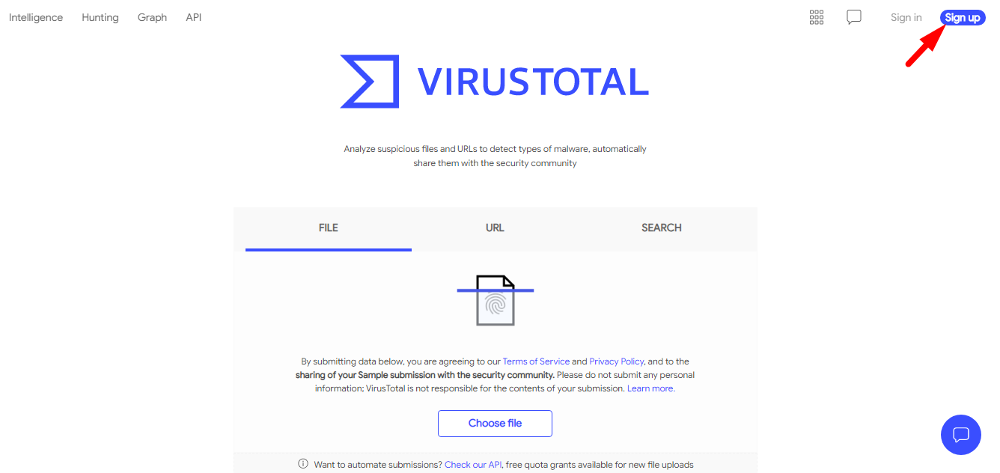
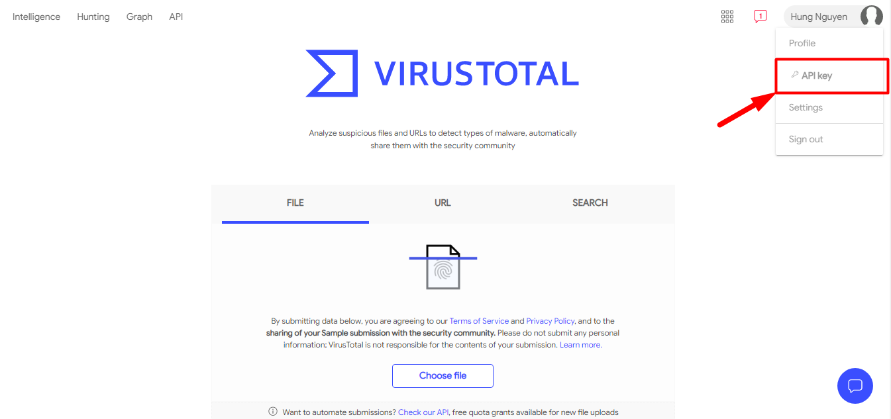

# Craw Subdomain

Tool sử dụng để craw các subdomain sau đó gửi kết quả về telegram.

### 1. Cài đặt các gói cần thiết 

```
apt-get update -y
apt install -y git nmap curl
apt install python3-pip -y
```

### 2. Cài đặt elasticsearch 

- Cài đặt các phụ thuộc

```
apt install -y openjdk-8-jre apt-transport-https
```

- Cài đặt elasticsearch 

```
wget -qO - https://artifacts.elastic.co/GPG-KEY-elasticsearch | sudo apt-key add -
```
```
echo "deb https://artifacts.elastic.co/packages/7.x/apt stable main" | sudo tee -a /etc/apt/sources.list.d/elastic-7.x.list
```

```
apt update -y
apt install elasticsearch -y
```

- Chỉnh sửa cấu hình elasticsearch 

```
sed -i 's/#network.host: 192.168.0.1/network.host: localhost/g' /etc/elasticsearch/elasticsearch.yml
```

- Khởi động và xem trạng thái của elasticsearch

```
systemctl start elasticsearch
systemctl enable elasticsearch
systemctl status elasticsearch
```

- Tạo Index 

```
curl -X PUT "localhost:9200/subdomain?pretty"
```

- Set limit

```
curl -X PUT "localhost:9200/subdomain/_settings?pretty" -H 'Content-Type: application/json' -d'
{
  "index.mapping.total_fields.limit": 10000000000
}
'
```

### 3. Tạo tài khoản Virustotal 

Truy cập virustotal và kích vào tạo tài khoản. 



Sau khi đã có tài khoản đăng nhập virustotal, truy cập vào API key để lấy key API. 




Lưu lại api key để dùng cho bước sau.

### 4. Tải về tool và cài đặt môi trường

#### 4.1. Tải về tool

```
cd /opt
git clone https://github.com/hungviet99/craw_subdomain.git
```

- Cài đặt môi trường ảo python

```
cd /opt/craw_subdomain
pip3 install virtualenv
virtualenv env -p python3.6
source env/bin/activate
```

- Cài đặt các thư viện cần thiết

```
pip3 install -r requirements.txt
```

#### 4.2. Chỉnh sửa file config

- Thêm api virustotal

```
sed -i 's/API_VT =/API_VT = "17cd6d28652ea7dd99a0ea9abbfe07c68ecf8ath01e950fgdf2365af80b05967"/' /opt/craw_subdomain/config.py
```
>Lưu ý: Thay `17cd6d28652ea7dd99a0ea9abbfe07c68ecf8ath01e950fgdf2365af80b05967` bằng api virustotal của bạn.

- Thêm token bot 

```
sed -i 's/TOKEN_TELE =/TOKEN_TELE = "918364925:AAGbl5y7463f8DFFx4RhkeB3_eRhUUNfHHw"/' /opt/craw_subdomain/config.py
```

Thay `918364925:AAGbl5y7463f8DFFx4RhkeB3_eRhUUNfHHw` bằng token bot của bạn

- Thêm Chat ID

```
sed -i 's/CHAT_ID =/CHAT_ID = "633940211"/' /opt/craw_subdomain/config.py
```

Thay id `633940211` bằng chat id của bạn hoặc của group muốn nhận cảnh báo về trạng thái khi scan domain

#### 4.3 Tạo service subcraw

- Chuyển file service vào systemd

```
mv /opt/craw_subdomain/subcraw.service /etc/systemd/system/subcraw.service
```

- Khởi động dich vụ subcraw

```
systemctl daemon-reload
systemctl start subcraw
systemctl status subcraw
systemctl enable subcraw
```

- Đặt cron kiểm tra service 

```
chmod +x /opt/craw_subdomain/checkservice.sh
```

Sử dụng lệnh `crontab -e` sau đó ghi vào file contab nội dung sau:

```
*/20 * * * * /opt/craw_subdomain/checkservice.sh > /dev/null 2>&1
```

### 5. Kết quả 

Truy cập vào telegram

- Gõ `/start` để xem hướng dẫn  


- Truyền vào tên domain sẽ có các subdomain được gửi về 

